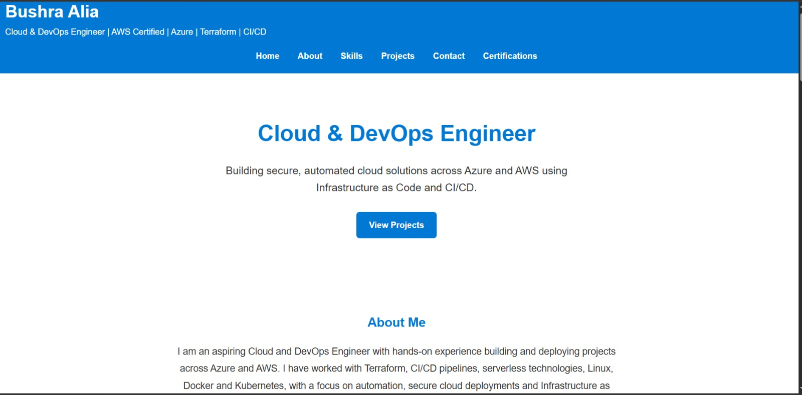
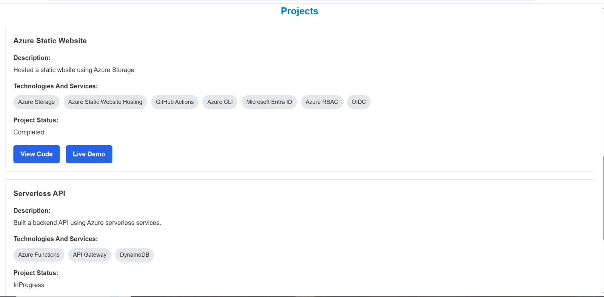
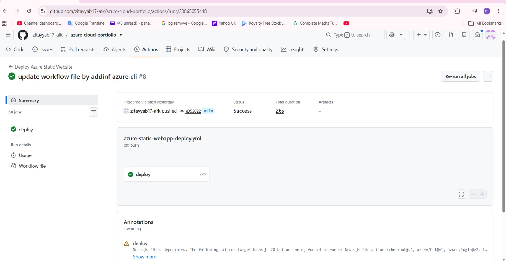
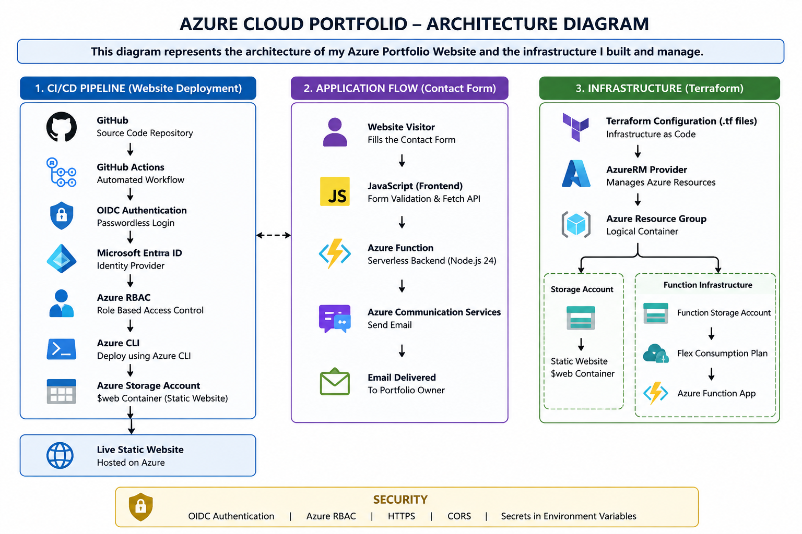

# ☁️ Azure Cloud & DevOps Portfolio

A personal Cloud & DevOps portfolio built and deployed on Microsoft Azure, demonstrating hands-on experience with cloud infrastructure, serverless computing, CI/CD automation, cloud security, JavaScript and Azure services.

The project was built incrementally and tested locally before being deployed to Azure. It now includes an automated CI/CD pipeline and a serverless contact-form backend that sends emails using Azure Communication Services.

---

## 🚀 Live Website

**Live Demo:**  
https://stazureportfoliob001.z33.web.core.windows.net/

---

## 📌 Project Overview

This project demonstrates the end-to-end process of developing, deploying, securing and automating a cloud-hosted portfolio on Microsoft Azure.

The portfolio showcases my Cloud & DevOps projects, technical skills and professional certifications while serving as a practical environment for developing hands-on Azure and DevOps engineering skills.

### Key Features

- Azure-hosted static website
- Automated CI/CD deployment
- Passwordless GitHub-to-Azure authentication using OIDC
- Serverless backend using Azure Functions
- Working contact form with email delivery
- Azure Communication Services Email integration
- Secure environment variable management
- CORS configuration
- JavaScript form validation
- Dynamic project and skills rendering
- AWS certification credential links
- Responsive portfolio design

---

## 🏗️ Architecture

The project contains two main workflows.

### Website CI/CD Deployment

```text
Developer
    ↓
Git Push to GitHub
    ↓
GitHub Actions
    ↓
OIDC Authentication
    ↓
Microsoft Entra ID
    ↓
Azure RBAC
    ↓
Azure CLI
    ↓
Azure Storage $web Container
    ↓
Live Portfolio Website
```

### Serverless Contact Form

```text
Website Visitor
    ↓
Azure-hosted Portfolio
    ↓
JavaScript Contact Form
    ↓
HTTP POST Request
    ↓
Azure Function
    ↓
Azure Communication Services Email
    ↓
Email Inbox
```

The frontend and backend are separated so that sensitive credentials are not exposed in browser-side JavaScript.

---

## ⚙️ CI/CD Pipeline

A GitHub Actions workflow automatically deploys website changes whenever code is pushed to the `main` branch.

The pipeline:

1. Checks out the repository.
2. Requests an OIDC token from GitHub.
3. Authenticates to Azure through Microsoft Entra ID.
4. Uses Azure RBAC for authorization.
5. Uses Azure CLI to deploy the website.
6. Uploads the contents of the `website/` directory to the Azure Storage `$web` container.
7. Updates the live website automatically.

This removes the need for manual website uploads after each change.

---

## ⚡ Serverless Contact Form

The portfolio includes a working serverless contact form.

The frontend collects:

- Name
- Email address
- Subject
- Message

JavaScript validates the fields before sending the form data as JSON to an HTTP-triggered Azure Function.

The Azure Function:

1. Receives the HTTP POST request.
2. Reads the submitted JSON data.
3. Uses Azure Communication Services Email.
4. Sends the contact message to my email inbox.
5. Returns a success response to the frontend.

After a successful response, the website displays:

`Message sent successfully!`

The form is then automatically cleared.

---

## 📧 Azure Communication Services Email

Azure Communication Services Email is used to deliver messages submitted through the portfolio contact form.

The implementation includes:

- Azure Communication Services
- Email Communication Service
- Azure-managed email domain
- Connected email domain
- Sender address
- Azure Communication Services Email SDK

The ACS connection string is **never stored in the frontend JavaScript**.

During local development, it is stored in:

```text
local.settings.json
```

In Azure, it is configured as a Function App environment variable:

```text
ACS_CONNECTION_STRING
```

`local.settings.json` is excluded from source control using `.gitignore`.

---

## 🌐 CORS Configuration

Cross-Origin Resource Sharing (CORS) is configured on the Azure Function App so that the production portfolio website can communicate with the serverless backend.

A localhost origin was temporarily allowed during local development and testing.

After production testing was completed, the temporary local origin was removed and access was restricted to the live Azure-hosted portfolio origin.

---

## 🔐 Cloud Security

Security practices implemented throughout the project include:

- Passwordless GitHub-to-Azure authentication using OIDC
- Microsoft Entra ID App Registration
- Azure RBAC authorization
- `Storage Blob Data Contributor` assigned at Storage Account scope
- Principle of least privilege
- No Azure client secret stored in the GitHub Actions workflow
- ACS connection string stored as an environment variable
- Local secrets excluded from source control
- CORS restricted to the production frontend origin
- Backend credentials never exposed in frontend JavaScript

---

## 🛠️ Technologies Used

### Microsoft Azure

- Azure Storage
- Azure Static Website Hosting
- Azure Functions
- Azure Communication Services
- Email Communication Service
- Microsoft Entra ID
- Azure RBAC
- Azure CLI

### DevOps

- Git
- GitHub
- GitHub Actions
- CI/CD
- OIDC
- YAML
- Environment Variables

### Development

- HTML5
- CSS3
- JavaScript
- Node.js
- Fetch API
- HTTP
- JSON
- DOM Manipulation

---

## ✨ Website Features

- Responsive Cloud & DevOps portfolio
- Professional About Me section
- Responsive Skills grid
- AWS certification section
- Official credential verification links
- Dynamic Skills rendering using JavaScript
- Dynamic Project Cards generated from JavaScript objects
- Conditional Live Demo buttons
- GitHub repository links
- JavaScript contact-form validation
- Serverless contact-form backend
- Email delivery through Azure Communication Services
- Responsive navigation

---

## 🎓 Certifications

### AWS Certified Solutions Architect – Associate

**Amazon Web Services (AWS)**  
Issued February 2026 · Expires February 2029

**Verify Credential:**  
https://www.credly.com/badges/e7b9aa6d-3081-4b13-a5d7-c6651179afae/public_url

### AWS Certified Cloud Practitioner

**Amazon Web Services (AWS)**  
Issued December 2025 · Expires December 2028

**Verify Credential:**  
https://www.credly.com/badges/b16d0e15-fdb1-42a5-b182-027acfc04b5c/public_url

---

## 📂 Repository Structure

```text
Azure-Portfolio/
│
├── .github/
│   └── workflows/
│       └── azure-static-webapp-deploy.yml
│
├── website/
│   ├── index.html
│   ├── style.css
│   ├── script.js
│   └── 404.html
│
├── function/
│   ├── src/
│   │   └── functions/
│   │       └── ContactFormFunction.js
│   ├── host.json
│   ├── package.json
│   └── local.settings.json
│
├── docs/
├── screenshots/
├── terraform/
├── README.md
└── .gitignore
```

> `local.settings.json` is used for local development only and is excluded from Git through `.gitignore`.

---

## 📸 Project Screenshots

### Live Portfolio Homepage



### Projects Section



### Successful GitHub Actions Deployment



### Project Architecture Diagram



---

## 🧩 Challenges & Troubleshooting

Several real development and cloud deployment issues were encountered and resolved during this project.

### GitHub Actions OIDC Permission

The workflow initially failed because GitHub Actions did not have permission to request an OIDC token.

This was resolved by configuring:

```yaml
permissions:
  id-token: write
  contents: read
```

### Azure Storage Authentication

Azure CLI initially failed to use the authenticated OIDC session correctly when uploading the website.

This was resolved by using:

```text
--auth-mode login
```

so the deployment uses the authenticated OIDC session.

### Azure RBAC

The GitHub Actions service principal required permission to upload website files.

`Storage Blob Data Contributor` was assigned at Storage Account scope rather than granting unnecessarily broad permissions.

### Static Website 404

The initial Azure-hosted website returned a 404 because the website files had not been correctly uploaded to the Azure Storage `$web` container.

The issue was identified, the deployment was corrected, and the live endpoint was successfully verified.

### Azure Functions Local Storage

During local Function development, the Functions runtime reported:

```text
Unable to access AzureWebJobsStorage
```

The local development configuration was corrected before Function testing continued.

### CORS

During development, the browser initially blocked communication between the locally hosted frontend and Azure Function because they were running on different origins.

CORS was configured to allow local testing.

After the application was deployed and successfully tested in production, the temporary localhost origin was removed.

### PowerShell npm Execution Policy

During Azure Function deployment, Windows PowerShell attempted to execute `npm.ps1`, which was blocked by the local execution policy.

The VS Code Function tasks were changed to use:

```text
npm.cmd
```

instead of:

```text
npm
```

The Function deployment then completed successfully.

---

## 🧪 Testing

The application was tested both locally and in production.

### Local Testing

- JavaScript form validation tested through Live Server
- Azure Function executed locally
- HTTP POST requests tested
- JSON request and response flow verified
- Azure Communication Services email delivery verified
- Successful form reset verified

### Production Testing

The complete production flow was tested using the actual Azure-hosted portfolio:

```text
Azure Static Website
        ↓
JavaScript Contact Form
        ↓
Azure Function
        ↓
Azure Communication Services Email
        ↓
Email Inbox
```

The final production test confirmed:

- Contact form submission succeeds
- Azure Function executes successfully
- Email is delivered to the inbox
- Success message appears
- Form clears after successful submission
- Production CORS configuration works correctly

---

## 📚 What I Learned

Through this project I gained hands-on experience with:

- Azure Storage and Static Website Hosting
- Azure Functions
- Serverless architecture
- Azure Communication Services
- CI/CD pipeline implementation
- GitHub Actions workflows
- Git and GitHub
- Azure CLI
- Microsoft Entra ID
- OIDC federation
- Azure RBAC
- Least-privilege cloud security
- Environment variable management
- CORS
- Node.js
- JavaScript DOM manipulation
- Fetch API
- HTTP requests
- JSON
- Local and production testing
- Cloud deployment troubleshooting

---

## 🔮 Future Improvements

Planned improvements include:

- Infrastructure as Code using Terraform
- Azure Monitor / Application Insights
- Improved contact-form error handling
- Loading state while messages are being sent
- Automated testing
- Updated architecture documentation
- Additional project screenshots
- Further responsive design improvements

---

## 🎯 Project Purpose

This project forms part of my practical Cloud & DevOps portfolio and demonstrates skills relevant to entry-level opportunities in:

- Cloud Engineering
- DevOps Engineering
- Platform Engineering
- Cloud Support
- Site Reliability Engineering (SRE)

---

## 👩‍💻 Author

**Bushra Alia**

Cloud & DevOps Engineer  
AWS Certified Solutions Architect – Associate  
AWS Certified Cloud Practitioner